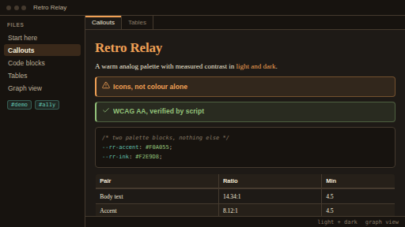
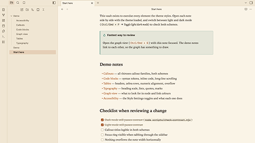

# Retro Relay

A warm analog theme for [Obsidian](https://obsidian.md) — graphite-and-cream in
the dark, ink-on-paper in the light, with an amber accent running through
both. Every colour pair it ships with has been measured against WCAG 2.1 AA
rather than eyeballed.



## Features

- **Both colour schemes, equally finished.** Light mode is a full paper-and-ink
  palette, not a washed-out inversion of the dark one.
- **Measured contrast.** 34 foreground/background pairs are checked by a script
  in this repo. Body text and accents target 4.5:1; code comments and border
  seams target the large-text and non-text thresholds. Run it yourself:
  `node scripts/check-contrast.mjs`.
- **Meaning is never colour-only.** Callouts carry icons, unresolved links get a
  dotted underline, the active tab gets an accent rule, and heading hierarchy
  steps down by weight and size as well as hue — so the theme survives
  greyscale printing and colour-blind viewing.
- **Graph view styled in both schemes.** Notes, tags, attachments and unresolved
  nodes are separated, links sit back, and the canvas uses the theme ground
  instead of black.
- **An orbital plate behind the graph.** A faint star glow, coloured orbits
  and a reticle give the force-directed layout a chart to drift across —
  faint by default, and adjustable, since the graph itself stays the subject.
- **A chromatic spectrum band and drifting atmosphere.** A broadcast-style
  colour bar along the window's top edge (smooth by default, or a hard-edged
  VHS variant) and a faint cloud wash across dark-mode panes, both optional.
- **All thirteen callout families.** Every Obsidian callout keyword resolves to
  an intentional colour, aliases included.
- **Polished code.** Full syntax token palette, bordered inline-code chips, a
  language badge on hover, and long lines that scroll inside the block instead
  of widening the note.
- **Tables that behave.** Shaded headers, zebra rows, tabular numerals, and
  horizontal overflow contained to the table.
- **Visible keyboard focus.** A two-pixel accent ring on every focusable
  element, via `:focus-visible`.
- **Respects system preferences.** `prefers-reduced-motion` and
  `prefers-contrast: more` are both honoured with no configuration.
- **Seventeen user settings** via the optional Style Settings plugin — and
  sensible defaults without it.
- **No network, no build step.** One `theme.css`, local font stacks only.
  Nothing is fetched at runtime.

## Screenshots

| Dark | Light |
|---|---|
|  |  |

## Installation

### From the community directory

Once the theme has been published to the directory:

1. **Settings → Appearance → Themes → Manage**
2. Search for **Retro Relay**
3. **Install and use**

### Manually

1. Download `theme.css` and `manifest.json` from the
   [latest release](../../releases/latest).
2. Create a folder named exactly `Retro Relay` in your vault at
   `.obsidian/themes/`.
3. Drop both files into it.
4. Restart Obsidian, then pick **Retro Relay** under
   **Settings → Appearance → Themes**.

The folder name has to match the `name` in `manifest.json` exactly, or Obsidian
will not list the theme.

### With the install script

From a clone of this repository:

```bash
bash scripts/install-local.sh          # finds your vaults, asks which
bash scripts/install-local.sh --all    # install into every vault found
bash scripts/install-local.sh --vault "/path/to/vault"
```

## Development

```bash
git clone https://github.com/RahelaQ/retro-relay.git
cd retro-relay

# Verify the palette still passes contrast after any edit
node scripts/check-contrast.mjs

# Build the clean release payload into dist/
node scripts/build-release.mjs
```

`test-vault/` is a ready-made vault that exercises every element the theme
styles — open it in Obsidian and the theme is already selected. After editing
`theme.css`, run `node scripts/build-release.mjs --sync-vault` to refresh the
copy inside it.

## Customization

### Without any plugin

All colour lives in two blocks in `theme.css` — `.theme-dark` (section 3) and
`.theme-light` (section 4). Everything from section 5 onward only references
those tokens, so re-skinning the theme means editing the palette and nothing
else:

```css
.theme-dark {
  --rr-accent: #F0A055;   /* links, H1, warnings, focus ring */
  --rr-teal:   #62C3B2;   /* tags, external links */
  --rr-ink:    #F2E9D8;   /* body text */
  --rr-bg-1:   #191C20;   /* editor background */
}
```

After changing anything, re-run `node scripts/check-contrast.mjs` — a custom
accent is not verified automatically.

### With Style Settings

Install the [Style Settings](https://github.com/mgmeyers/obsidian-style-settings)
community plugin and the theme exposes these under **Settings → Style Settings
→ Retro Relay**:

| Setting | Default | Effect |
|---|---|---|
| Always underline links | off | Links stop relying on colour (WCAG 1.4.1) |
| Increase contrast | off | Pushes ink to the extremes, firms up borders |
| Disable animations | off | Manual equivalent of `prefers-reduced-motion` |
| Dyslexia-friendly body font | off | OpenDyslexic / Atkinson Hyperlegible, looser spacing |
| Body font size | 16px | 12–24px |
| Body line height | 1.6 | 1.2–2.2 |
| Readable line length | 42rem | 30–90rem |
| Accent colour | per scheme | Separate light and dark values |
| Plain table rows | off | Turns zebra striping off |
| Scanline texture on headings | off | Cosmetic CRT nod |
| Hide the spectrum bar | off | Removes the chromatic band along the window's top edge |
| Hard-edged spectrum bar | off | Discrete broadcast colour bars instead of a smooth blend |
| Spectrum bar height | 6px | 2–12px |
| Stronger atmospheric wash | off | Deepens the dark-mode cloud field (still clears its contrast target, with less margin) |
| Hide the orbital plate | off | Removes the graph view's orbits, reticle and star glow |
| Orbit and reticle strength | 0.12 | 0–0.6 |
| Star glow strength | 0.05 | 0–0.4 |

Every toggle defaults to the theme's shipped behaviour, so installing the
plugin changes nothing until you touch a switch.

## Compatibility

- Requires Obsidian **1.5.0** or newer (the theme uses `:has()` and
  `prefers-contrast`).
- Desktop and mobile. No plugins are required; Style Settings is optional.

## Contributing

Issues and pull requests are welcome. Before opening a PR:

1. `node scripts/check-contrast.mjs` passes.
2. You have checked the change in **both** light and dark mode.
3. Any new colour is added to the palette blocks, not inlined in a rule.

## Credits

- Built for [Obsidian](https://obsidian.md), following the official
  [theme guidelines](https://docs.obsidian.md/Themes/App+themes/Build+a+theme).
- Optional settings integration via
  [Style Settings](https://github.com/mgmeyers/obsidian-style-settings) by
  mgmeyers.
- Icon paths in the development preview pages under `scripts/` are from
  [Lucide](https://lucide.dev) (ISC licence), the icon set Obsidian itself uses.
- Font stacks reference Iosevka, JetBrains Mono, IBM Plex Mono, Iowan Old Style
  and Charter where installed, falling back to system fonts. None are bundled
  or downloaded.

## Licence

[MIT](LICENSE) © 2026 RahelaQ
